# Veri MVP Flow - Clean Mermaid (Earn-to-Use Model)

```mermaid
flowchart TD
    %% Landing & Onboarding
    A[🎯 Connect to Earn<br/>AI tools that boost your revenue] --> B[📱 OAuth Connect: YouTube • TikTok • Twitch<br/>Analyze your existing content for revenue opportunities]
    B --> C[🎉 Welcome: 25 Points Earned<br/>Enough for 2 tool trials • See instant results]

    %% Quick Setup
    C --> D[📝 Profile Setup<br/>Basic info + content examples]
    D --> E[🔍 Content Import<br/>Scan existing videos for optimization]
    E --> F[📊 Matera Score<br/>Initial creator ranking calculated]

    %% Immediate Revenue Tools - Trial Only
    F --> G[💰 Try Revenue Tools<br/>See your monetization potential]

    G --> H{Choose Tool Trial}
    H -->|10 pts| I[📈 Revenue Refresh Trial<br/>Optimize 1 video's thumbnail/title]
    H -->|15 pts| J[💰 Affiliate Scanner Trial<br/>Find monetization in existing content]
    H -->|20 pts| K[📱 Clip Multiplier Trial<br/>Turn 1 video into 5 revenue streams]
    H -->|25 pts| L[🔥 Trend-Hunter Ideation Trial<br/>Get trending content ideas that monetize]

    %% Show Results with Specific Projections
    I --> M[📊 +15-30% CPM increase estimated<br/>Want to optimize your entire catalog?]
    J --> N[🔗 $50-200/month passive income potential<br/>Want to auto-scan all your content?]
    K --> O[📈 5x content output • 3x revenue streams<br/>Want unlimited clip generation?]
    L --> P[🎯 3 high-CPM content ideas + monetization scripts<br/>Want trending ideas for every upload?]

    %% Decision Hub - Points Required for More Usage
    M --> Q[🔒 Unlock More Usage<br/>Complete brand tasks to earn points]
    N --> Q
    O --> Q
    P --> Q

    Q --> R[💎 Brand Tasks<br/>Earn points to unlock tool usage]

    %% P2P Engagement System - Points Only
    R --> S[🎯 Studio Engagement Tasks<br/>Complete tasks to earn points]
    S --> T{Task Selection}

    T -->|+25 pts| U[📱 Social Engagement<br/>Follow/like studio content]
    T -->|+35 pts| V[📢 Content Amplification<br/>Share studio content to your audience]
    T -->|+50 pts| W[🎬 Clip Creation<br/>Create branded moment clips]

    %% Task Completion
    U --> X[✅ Task Complete<br/>Points awarded]
    V --> X
    W --> X

    X --> Y[💳 Points Balance Update<br/>Track total points earned]
    Y --> Z[📈 Matera Score Boost<br/>Performance impacts ranking]
    Z --> AA{Spend Points}

    %% Tool Usage Unlocks - Earn-to-Use
    AA -->|10 pts per use| BB[📈 Revenue Refresh<br/>Optimize another video]
    AA -->|15 pts per use| CC[💰 Affiliate Scanner<br/>Scan another video for monetization]
    AA -->|20 pts per use| DD[📱 Clip Multiplier<br/>Create more short-form content]
    AA -->|25 pts per use| EE[🔥 Trend-Hunter Ideation<br/>Get trending content ideas + scripts]
    AA -->|Save points| FF[💰 Point Savings<br/>Build up for bigger optimizations]

    %% Tool Usage Results
    BB --> GG[📊 Content Optimized<br/>Revenue potential increased]
    CC --> GG
    DD --> GG
    EE --> GG
    FF --> GG

    %% Creator Hub - Final Destination
    GG --> HH[📊 Revenue Dashboard<br/>Track optimization results across content]
    HH --> II[📈 Performance Analytics<br/>See which optimizations work best]
    II --> JJ[🧠 Content Insights<br/>AI recommendations for next optimizations]

    %% Signal Engine Backend Processing
    JJ --> KK[🔮 Signal Engine Processing<br/>Every action improves your optimization AI]
    KK --> LL[🤖 BrightMatter AI Analysis<br/>Generate better recommendations]
    LL --> MM[💡 Personalized Suggestions<br/>AI learns your content style]

    %% Re-engagement Loops
    MM --> R
    JJ --> S
    GG --> S

    %% Styling
    classDef entry fill:#FFE4B5,stroke:#F4A460,stroke-width:3px
    classDef setup fill:#98FB98,stroke:#32CD32,stroke-width:2px
    classDef trial fill:#F5D0A0,stroke:#D2691E,stroke-width:3px
    classDef tasks fill:#FFB3BA,stroke:#DC143C,stroke-width:3px
    classDef unlock fill:#87CEEB,stroke:#4682B4,stroke-width:3px
    classDef dashboard fill:#DDA0DD,stroke:#9932CC,stroke-width:2px
    classDef ai fill:#B3FFB3,stroke:#228B22,stroke-width:2px

    class A,B,C entry
    class D,E,F setup
    class G,H,I,J,K,L,M,N,O,P,Q trial
    class R,S,T,U,V,W,X,Y,Z tasks
    class AA,BB,CC,DD,EE,FF,GG unlock
    class HH,II,JJ dashboard
    class KK,LL,MM ai

```

## **mvp messaging framework**

| **flow section** | **core message** | **value proof** |
| --- | --- | --- |
| **landing (a)** | "ai tools that boost your revenue" | immediate monetization focus |
| **oauth (b)** | "analyze existing content for instant optimization" | platform compatibility + purpose |
| **welcome (c)** | "25 points = 2 tool trials" | concrete value quantification |
| **tool trials (h-l)** | "see your monetization potential" | specific dollar/percentage estimates |
| **results (m-p)** | "+15-30% cpm boost estimated" | grounded projections |
| **unlock prompt (q)** | "complete brand tasks to earn points" | clear earn-to-use mechanic |
| **tasks (s-t)** | "earn points to unlock tool usage" | points economy clarity |
| **tool usage (aa-ff)** | "10-25 pts per use" | transparent cost structure |
| **signal engine (kk)** | "every action improves your ai" | personalization benefit |

**key mvp features:**

- **earn-to-use model** → trial tools, earn points, spend points for more usage
- **points-only economy** → no direct money, manual brand payout system
- **simplified tasks** → studio engagement focused, no complex campaigns
- **core ai loop** → signal engine + brightmatter process all actions
- **clear end state** → revenue dashboard + content insights as final destination